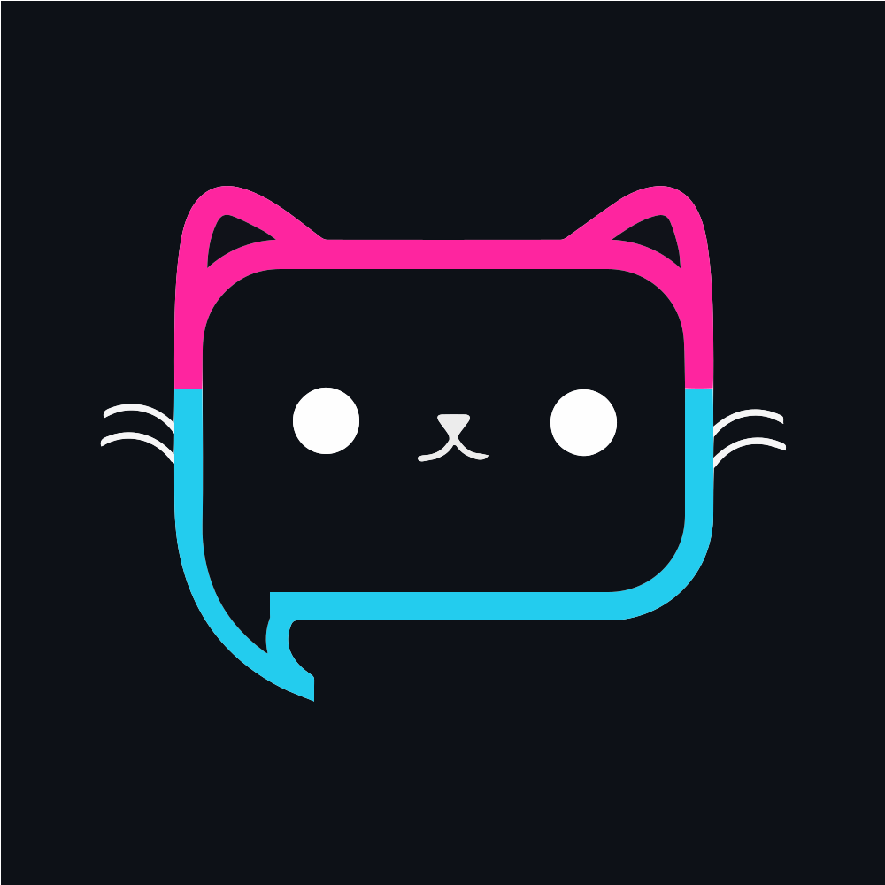

<!-- PROJECT LOGO -->
<br />
<p align="center">
  <span style="font-family:Papyrus; font-size:50px;"></span>
  <h3 align="center">Chat Application</h3>

  <p align="center">
    Hello from the other side
    <br />
    <br />
    <a href="https://github.com/rustyxlol/Django-ChatApp/issues">Report Bug</a>
  </p>
</p>

# Chat Application 

A simple chat application that covers Django authorization, web sockets and authentication.

Demo:  

https://user-images.githubusercontent.com/27452933/176642830-ae9db47e-da84-40ca-8485-03074d0cd106.mp4


### Features ⭐

1. CRUD users
2. Create rooms and chat in groups!
3. Good looking UI
4. Authenticated WebSockets to prevent unauthorized access

## Setup 🛠
1. Clone or download the repository  
```bash
git clone https://github.com/rustyxlol/Django-ChatApp.git
cd chat-app-django
```
2. Create and activate virtual environment
```bash
python -m venv venv
```
Windows: `venv\Scripts\activate.bat`  
Linux: `source venv/bin/activate`

3. Install required packages
```bash
python -m pip install -r requirements.txt
```

4. Navigate to chat-app-django and run the server
```bash
python manage.py runserver
```
*Note: make migrations if any error occurs*
```bash
python manage.py makemigrations
python manage.py migrate
```

5. Navigate to http://127.0.0.1:8000 on a browser of your choice.

## Procedure
### Part 1 - Login and Signup Forms
1. Users model
2. **Pages:** Login, Signup, Home, Profile, (part of send message, more in next part)
3. CRUD operations on profile(username, profile picture...)
### Part 2 - Chat application
1. Channels Library 
2. Implementing basic functionality first then redoing it in async
3. TODO: Redis can come during production, channel layer is set to `InMemoryChannelLayer` for development.
4. Converted basic functionality to async
5. Added context processors for sidebar channels
6. Two public channels exist which anyone should be able to use, authentication in the next part.
7. Added messages model for permanent storage
### Part 3(optional) - Authenticating WebSockets

1. The simplest approach is to use basic authentication provided by Channels by scoping our consumer in websocket connect function like so.  
*Note: AuthMiddlewareStack is required.*
```py
user = self.scope['user']
if user.is_authenticated:
    // authenticated user connection 
else:
    // unauthenticated acces - disconnect/close
```
2. Another approach is to use Tokens - essentially create a token on the client side and send it over to the backend for authentication.  
   * Requires custom middleware
   * Requires `djangorestframework`
   * Hard to work with because tokens cannot be passed to headers
   * Have to establish connection first, then send a token, might pose security risks

3. Third approach is to use sessions

The first and second approaches are covered in this application, look `session-based` branch for the third approach.

### Resources
1. [Django Tutorial - Corey Schafer](https://www.youtube.com/watch?v=UmljXZIypDc&list=PL-osiE80TeTtoQCKZ03TU5fNfx2UY6U4p) 
2. [Django Channels - RealPython](https://realpython.com/getting-started-with-django-channels/)
3. [Django Channels](https://channels.readthedocs.io/)
4. [Django Channels and WebSockets oversimplified - Dennis Ivy](https://www.youtube.com/watch?v=cw8-KFVXpTE)
5. [Token Auth middleware ideas](https://gist.github.com/rluts/22e05ed8f53f97bdd02eafdf38f3d60a)

## License

Distributed under the MIT License. See `LICENSE` for more information.
